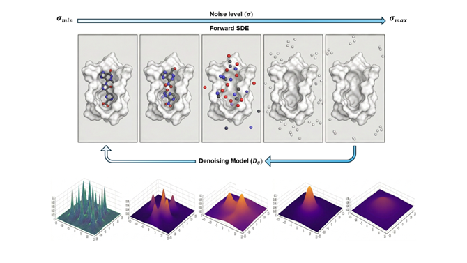

# SphericalDiff

<a href="https://pytorch.org/get-started/locally/"></a>
<a href="https://pytorchlightning.ai/"></a>
<a href="https://hydra.cc/"></a>
<a href="https://e3nn.org/"></a>
<a href="https://creativecommons.org/licenses/by-nc-sa/4.0/"></a>
</div>

---

## Overview

**SphericalDiff** is a structure-based drug design (**SBDD**) model that generates chemically valid, geometrically accurate 3D ligand molecules conditioned on target protein binding pockets. The model couples an **Elucidated Diffusion Model (EDM)** framework with a novel **MACE-many-body atomic cluster expansion** backbone (`EGNN_Spherical`), enabling expressive, many-body E(3)-equivariant message passing with separate noise schedules for atomic coordinates and atom-type features.

<div align="center">

> *"Generating 3D drug-like molecules directly in binding pockets via E(3)-equivariant many-body diffusion with spherical harmonic representations."*

 

<div align="center">
  <video src="https://github.com/user-attachments/assets/8d5e4779-6518-421e-932e-fffd143993d7" 
         autoplay 
         loop 
         muted 
         playsinline 
         preload="auto" 
         width="100%">
  </video>
</div>
</div>

---

## Table of Contents

- [System Requirements](#system-requirements)
- [Installation](#installation)
- [Data Preparation](#data-preparation)
  - [CrossDocked Benchmark](#crossdocked-benchmark)
  - [Binding MOAD](#binding-moad)
- [Demo](#demo)
- [Training](#training)
- [Evaluation](#evaluation)
  - [Molecular Metrics](#molecular-metrics)
  - [Docking with QuickVina 2](#docking-with-quickvina-2)
- [Configuration Reference](#configuration-reference)
- [Acknowledgements](#acknowledgements)
- [Citation](#citation)

---

---

## System Requirements

### OS Requirements

Developed and tested under **Python 3.10.x**. Refer to `environment.yaml` for the complete pinned dependency list.

---

## Installation

**Clone and install dependencies**
```bash
git clone https://github.com/KhacMinhlab/SphericalDiff
cd SphericalDiff

conda env create -f environment.yml
conda activate SphericalDiff

pip install -e .
```

**Download model checkpoints**
```bash
# From your checkpoint host (e.g. Zenodo or HuggingFace)
wget https://<your-checkpoint-url>/SphericalDiff_Checkpoints.tar.gz
tar -xzf SphericalDiff_Checkpoints.tar.gz
rm SphericalDiff_Checkpoints.tar.gz
```

### QuickVina 2 (for docking evaluation)
```bash
wget https://github.com/QVina/qvina/raw/master/bin/qvina2.1
chmod +x qvina2.1
mv qvina2.1 $HOME/mambaforge/envs/SphericalDiff/bin
```

For receptor preparation (PDB → PDBQT), create a separate MGLTools environment to avoid dependency conflicts:
```bash
mamba create -n mgltools -c bioconda mgltools
```

---

## Data Preparation

### CrossDocked Benchmark

Download and extract the dataset following the instructions from [Pocket2Mol](https://github.com/pengxingang/Pocket2Mol/tree/main/data). Then process the raw data:

```bash
python process_crossdock.py <crossdocked_dir> --no_H
```

The processed dataset will be saved with C-alpha only pocket representations by default (matching the `CA` pocket mode in the config).

### Binding MOAD

**Download the dataset:**
```bash
wget https://zenodo.org/record/<record_id>/files/every_part_a.zip
wget https://zenodo.org/record/<record_id>/files/every_part_b.zip
wget https://zenodo.org/record/<record_id>/files/every.csv

unzip every_part_a.zip
unzip every_part_b.zip
```

**Process the raw data:**
```bash
python process_bindingmoad.py <bindingmoad_dir>

# To suppress RDKit / BioPython warnings:
python -W ignore process_bindingmoad.py <bindingmoad_dir>
```

---

## Demo

### Generate molecules for a given binding pocket

```bash
python generate_ligands.py <checkpoint>.ckpt \
    --pdbfile <protein>.pdb \
    --outdir results/ \
    --resi_list A:1 A:2 A:3 A:4 A:5 A:6 A:7
```

Alternatively, specify the pocket via a reference ligand:
```bash
python generate_ligands.py <checkpoint>.ckpt \
    --pdbfile <protein>.pdb \
    --outdir results/ \
    --ref_ligand <chain>:<residue_id>
```

**Optional flags:**

| Flag | Description |
|------|-------------|
| `--n_samples` | Number of molecules to sample (default: 100) |
| `--sanitize` | Remove chemically invalid molecules post-sampling |
| `--relax` | Relax generated structures in a force field |
| `--all_frags` | Retain all disconnected fragments |
| `--resamplings` | Number of inpainting resamplings |


---

## Training

**Start a new training run:**
```bash
python -u train.py --config configs/ca_config_sphericaldiff.yml
```

**Resume from a checkpoint:**
```bash
python -u train.py --config configs/ca_config_sphericaldiff.yml --resume <checkpoint>.ckpt
```

Key training hyperparameters are managed through Hydra config files. A reference configuration for the CA-pocket EDM+MACE model is provided in `ca_config_edm_mace_independent.yml`.

---

## Evaluation

### Reproduce Paper Results

To sample molecules for the full test set:
```bash
python test.py <checkpoint>.ckpt \
    --test_dir <bindingmoad_dir>/processed_noH/test/ \
    --outdir <output_dir> \
    --fix_n_nodes
```

The `--fix_n_nodes` flag constrains the sampled molecules to have the same number of heavy atoms as the reference ligand (used for fair comparison in benchmarks).

### Molecular Metrics

To compute QED, SA, LogP, Lipinski, and diversity scores:

```python
from analysis.metrics import MoleculeProperties

mol_metrics = MoleculeProperties()
all_qed, all_sa, all_logp, all_lipinski, per_pocket_diversity = \
    mol_metrics.evaluate(pocket_mols)
```

`evaluate()` accepts a list of lists, where each inner list holds all RDKit `Mol` objects generated for a single pocket.

### Docking with QuickVina 2

**Step 1 — Prepare receptor files (PDB → PDBQT):**
```bash
conda activate mgltools
cd analysis
python2 docking_py27.py \
    <bindingmoad_dir>/processed_noH/test/ \
    <docking_outdir> \
    bindingmoad
cd ..
conda deactivate
```

**Step 2 — Run docking:**
```bash
conda activate SphericalDiff
python3 analysis/docking.py \
    --pdbqt_dir <docking_outdir> \
    --sdf_dir <test_outdir> \
    --out_dir <qvina_outdir> \
    --write_csv \
    --write_dict \
    --dataset moad
```

> Downstream molecule analysis scripts are available in `analysis/inference_analysis.py` and `analysis/molecule_analysis.py`.

---

## Acknowledgements

SphericalDiff is built upon and inspired by the following outstanding works:

- [GCDM-SBDD](https://github.com/BioinfoMachineLearning/GCDM-SBDD) — Geometry-Complete Diffusion for SBDD
- [DiffSBDD](https://github.com/arneschneuing/DiffSBDD) — Diffusion-based structure-based drug design
- [MACE](https://github.com/ACEsuit/mace) — Many-body equivariant message passing
- [e3nn](https://github.com/e3nn/e3nn) — Euclidean neural networks library
- [Pocket2Mol](https://github.com/pengxingang/Pocket2Mol) — Pocket-conditioned molecule generation
- [EDM (Karras et al.)](https://arxiv.org/abs/2206.00364) — Elucidating the Design Space of Diffusion-Based Generative Models

We sincerely thank all their contributors and maintainers.

---

## License

This project is licensed under the **Creative Commons Attribution-NonCommercial-ShareAlike 4.0 International License** (CC BY-NC-SA 4.0).

**Under this license, you are free to:**
* **Share**: Copy and redistribute the material in any medium or format.
* **Adapt**: Remix, transform, and build upon the material.

**Under the following terms:**
* **Attribution**: You must give appropriate credit, provide a link to the license, and indicate if changes were made.
* **NonCommercial**: You may not use the material for commercial purposes.
* **ShareAlike**: If you remix, transform, or build upon the material, you must distribute your contributions under the same license as the original.

See the [LICENSE](LICENSE.md) file for the full legal text.
---

## Citation

If you use SphericalDiff in your research, please cite:
